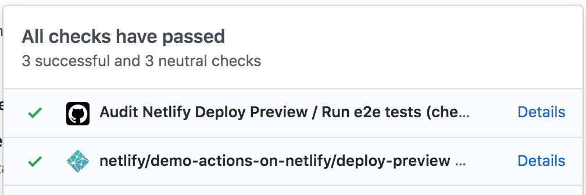

# Demo Actions on Netlify

**Demo running GitHub actions on Netlify deploy previews.**

## Setup

* This [GitHub workflow](.github/workflows/audit-deploy.yml) runs `on: check_suite`.
* The audit steps only run if Netlify deploy preview is successful (`if: github.event.check_suite.app.name == 'Netlify' && github.event.check_suite.conclusion == 'success'`).
* The audit runs on the deploy preview which is set before the audit runs: `https://deploy-preview-${prNumber}--${siteName}.netlify.com/`.

## Run end-to-end (E2E) tests on Netlify deploy preview using Cypress

* Sets `CYPRESS_BASE_URL` to the deploy url.
* Runs Cypress on this url.
